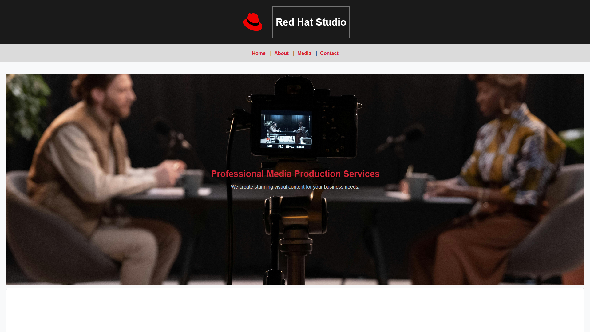
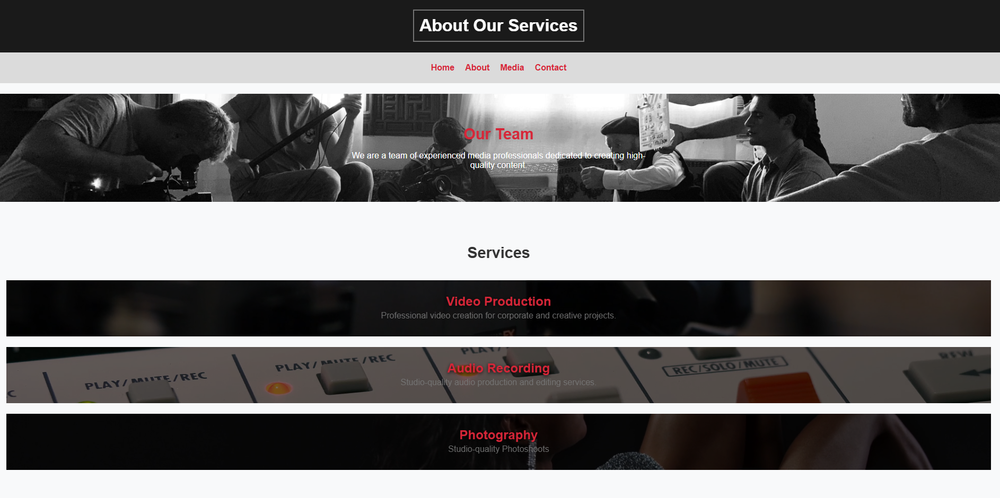
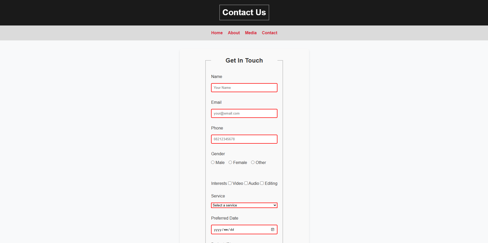
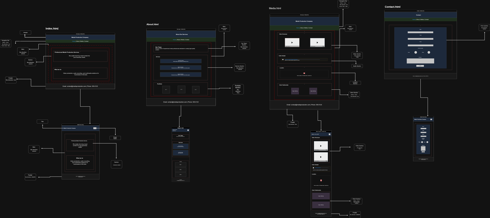

# Media Production Company Website

## Overview

The Media Production Company Website is a fully responsive, multi-page website designed to showcase professional media services, including video production, audio recording, photography, and multimedia solutions.

The project focuses on modern web development practices using semantic HTML, responsive CSS, accessibility standards, and interactive user experiences.

---

## Project Preview

### Homepage



### Services Page



### Gallery Page


### Contact Page



### Mobile Responsive View


---

## Wireframes

### Desktop Wireframe




---

## Issues Identified

### HTML Structure

* Missing semantic HTML elements such as:

  * `<header>`
  * `<main>`
  * `<section>`
  * `<footer>`
  * `<figure>`
  * `<figcaption>`
* Inconsistent heading hierarchy.
* Lack of descriptive metadata for SEO.

### Accessibility

* Missing or poor-quality alt text on images.
* Form fields lacked proper labels.
* Limited keyboard navigation support.
* Insufficient focus indicators for interactive elements.

### Responsiveness

* Navigation did not adapt well to smaller screens.
* Layouts broke on mobile devices.
* Images and media were not fully responsive.

### Forms and Media

* Missing validation on user input.
* Audio and video elements lacked fallback content.
* Some media controls were incomplete.

### CSS Maintainability

* Repeated CSS rules created unnecessary duplication.
* Inconsistent naming conventions.
* Limited use of reusable styling patterns.
* Styles were not grouped into clearly organized sections.

---

## Improvements Implemented

### Semantic HTML

* Rebuilt page structure using semantic HTML elements.
* Improved document readability and SEO.
* Established a logical heading hierarchy.

### SEO Enhancements

Added:

* Viewport meta tag
* Description meta tag
* Keywords meta tag

### Form Validation

Implemented HTML validation using:

* `required`
* `pattern`
* Appropriate input types
* Placeholder guidance where necessary

### Media Enhancements

* Added controls to media elements.
* Included fallback text for unsupported browsers.
* Improved embedding and responsiveness.

### CSS Refactoring

* Introduced CSS custom properties (variables).
* Removed duplicated styles.
* Standardized naming conventions.
* Organized styles into reusable modules.
* Improved maintainability and scalability.

### Responsive Design

* Applied Flexbox and CSS Grid layouts.
* Added responsive breakpoints.
* Ensured compatibility across desktop, tablet, and mobile devices.

--fgfgfg-

## Flexbox Usage

Flexbox was used to:

* Align navigation links horizontally.
* Create flexible service card layouts.
* Center content within hero sections.
* Distribute spacing consistently.
* Allow content to wrap on smaller screens.

### Example Layout


---

## CSS Grid Usage

CSS Grid was used to:

* Build gallery layouts.
* Create multi-column service sections.
* Improve visual hierarchy.
* Support responsive scaling using:

  * `auto-fit`
  * `minmax()`

### Example Layout


---

## Selectors and Pseudo-Classes

The project uses:

* `:hover`
* `:focus`
* `:active`
* `:nth-child()`

These selectors improve:

* User feedback
* Navigation usability
* Form interaction
* Accessibility

---

## Animations and Effects

Implemented:

* Smooth transitions
* Hover effects
* Scale transformations
* Fade-in animations
* Slide-in effects

### Animation Examples


---

## Accessibility Improvements

### Images

* Added meaningful alt text to all images.
* Ensured decorative images use appropriate empty alt attributes where necessary.

### Navigation

* Improved keyboard accessibility.
* Added visible focus indicators.

### Forms

* Added labels to all form inputs.
* Improved screen reader compatibility.

### Content Structure

* Maintained proper heading order.
* Used semantic landmarks for easier navigation.

### Visual Accessibility

* Improved color contrast ratios.
* Increased readability across devices.

---

## Cross-Browser Compatibility

Tested on:

* Google Chrome
* Mozilla Firefox
* Microsoft Edge

Measures taken:

* Used widely supported CSS features.
* Added fallbacks where appropriate.
* Verified responsive behavior across devices.

---

## Validation and Testing

### HTML Validation

* Verified semantic HTML structure.
* Checked for missing tags and nesting issues.

### CSS Validation

* Removed duplicate CSS rules.
* Standardized class naming conventions.
* Organized styles for maintainability.

### Responsive Testing

Tested across:

* Mobile devices
* Tablets
* Desktop screens

### Accessibility Testing

Reviewed:

* Keyboard navigation
* Focus states
* Alt text quality
* Form labels
* Color contrast

---

## Local Setup Instructions

### Clone the Repository

```bash
git clone https://github.com/Umuzi-skillslab/fix-and-complete-advanced-html-structure-theZoid9
```

### Navigate to the Project Directory

```bash
cd fix-and-complete-advanced-html-structure-theZoid9
```

### Open the Project

Open `index.html` in your browser or run a local development server.

---

## Technologies Used

* HTML5
* CSS3
* Flexbox
* CSS Grid
* Responsive Design
* Accessibility Best Practices

---

## Reflection

This project strengthened my understanding of building production-ready websites using semantic HTML, Flexbox, and CSS Grid.

Key lessons learned include:

* Creating accessible and responsive layouts.
* Structuring code for maintainability.
* Refactoring CSS to reduce duplication.
* Applying modern layout techniques effectively.
* Improving user experience through accessibility and interactive design.

The project also reinforced the importance of testing, validation, and documentation when developing professional web applications.
